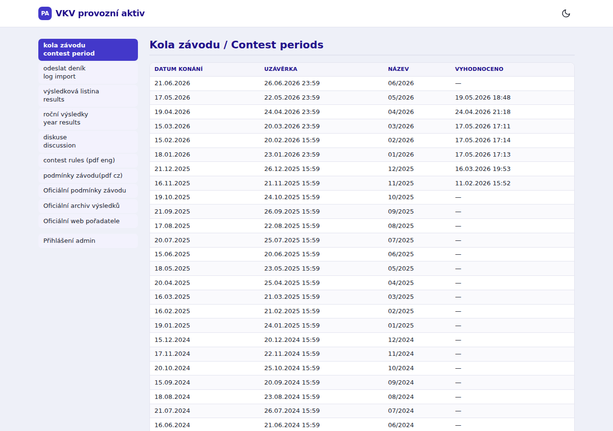
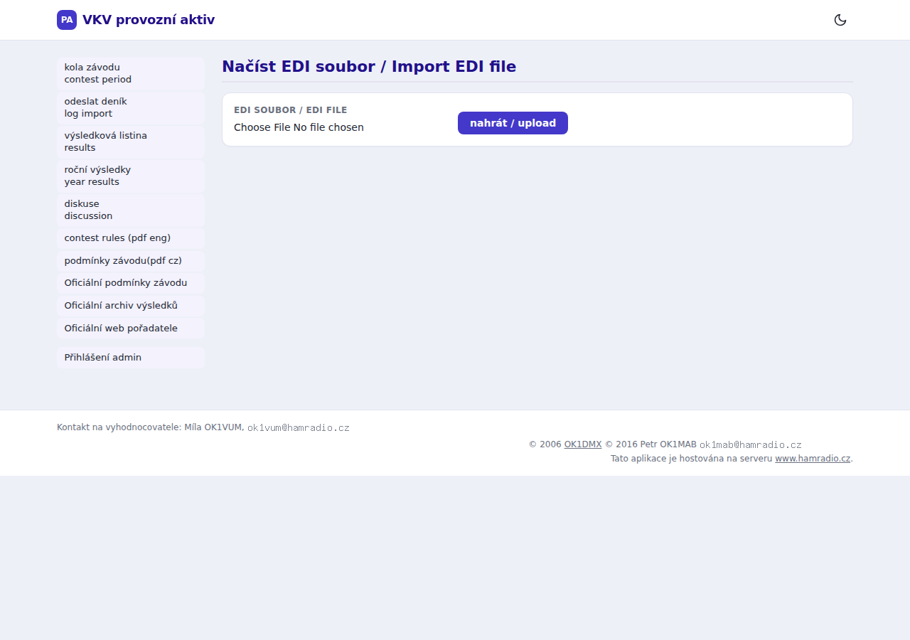
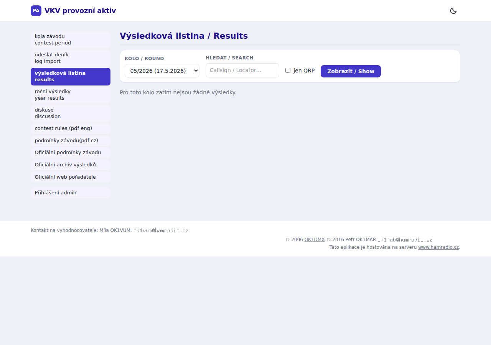
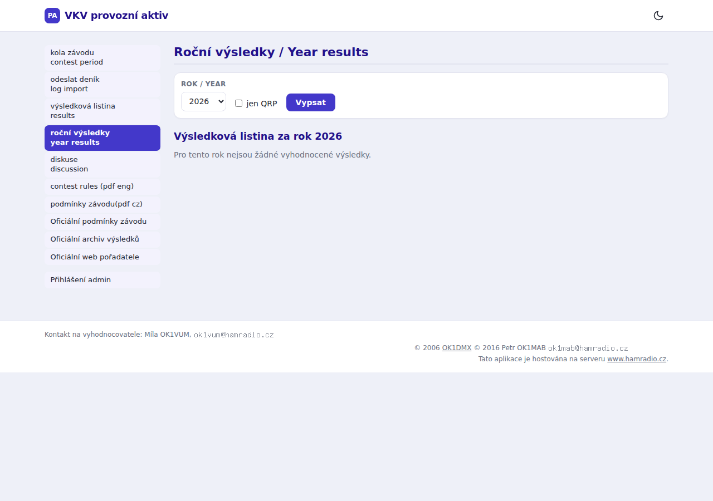
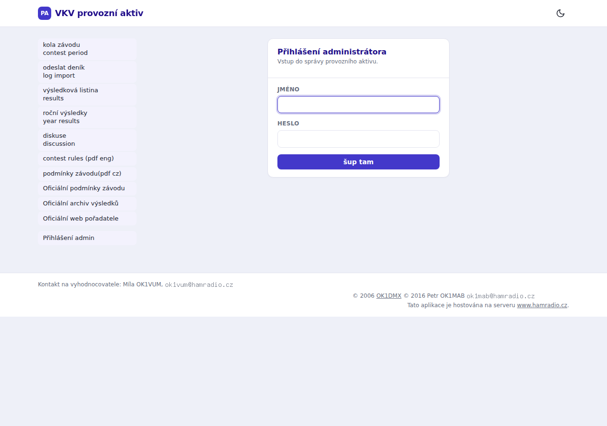
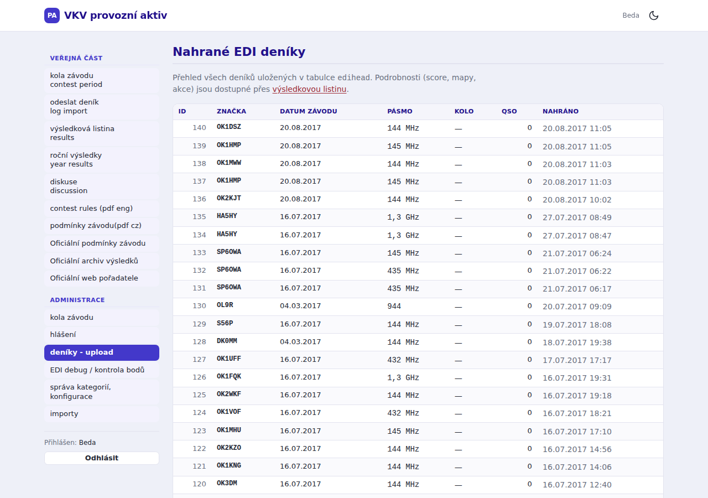
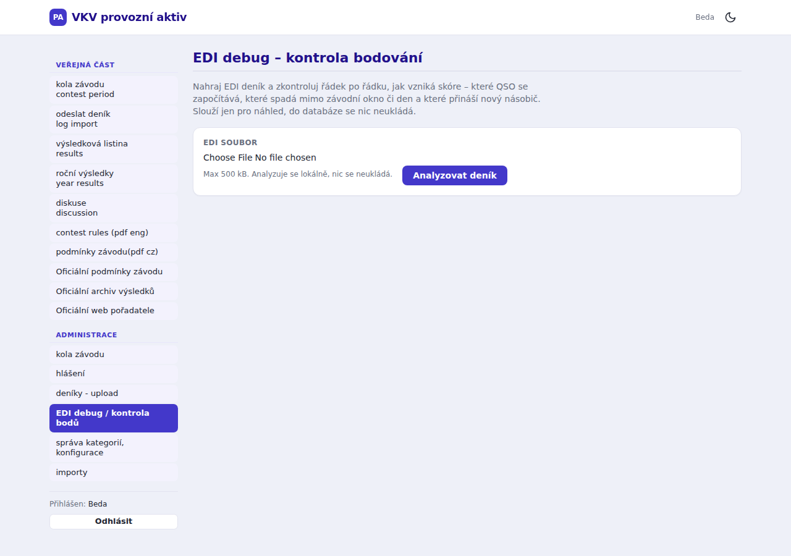
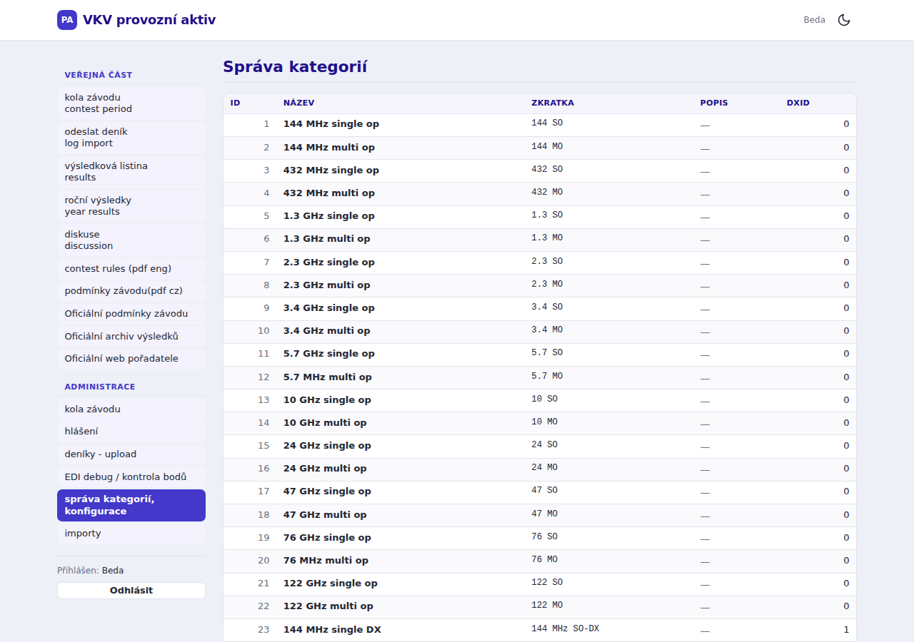
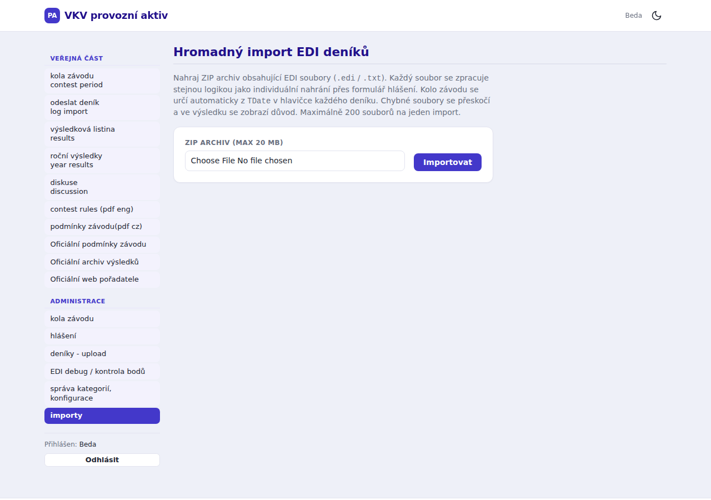

# VKV Provozní aktiv

Webový systém pro správu a vyhodnocování závodů v pásmu VKV (Very High Frequency) pro radioamatéry. Umožňuje registraci soutěžních deníků ve formátu EDI, automatické vyhodnocení, zobrazení výsledků a mapové vizualizace spojení.

> **Jazyk domény:** česky. Jména tras, databázové sloupce a terminologie jsou v češtině.

---

## Obsah

- [Technologie](#technologie)
- [Funkce](#funkce)
- [Náhledy aplikace](#náhledy-aplikace)
- [Architektura](#architektura)
- [Instalace](#instalace)
- [Docker](#docker)
- [Konfigurace prostředí](#konfigurace-prostředí)
- [Vývoj](#vývoj)
- [Testy a kvalita kódu](#testy-a-kvalita-kódu)
- [Databáze](#databáze)
- [Routování](#routování)
- [Autentizace](#autentizace)
- [EDI pipeline](#edi-pipeline)
- [Bodování](#bodování)
- [Mapové pohledy](#mapové-pohledy)
- [EDI vizualizace](#edi-vizualizace)
- [Diskuse](#diskuse)
- [REST API](#rest-api)
- [Emaily](#emaily)
- [Plánované příkazy](#plánované-příkazy)
- [PWA](#pwa)
- [CI/CD](#cicd)

---

## Technologie

| Vrstva | Technologie |
|--------|-------------|
| Backend | PHP 8.4, Laravel 13 |
| Frontend | Blade, Tailwind CSS 4.3, Vite 8 |
| Mapy | Leaflet 1.9.4 |
| Grafy | Chart.js 4.5 |
| Databáze | MySQL 8.0 (s `ALLOW_INVALID_DATES`) |
| Fronty | Laravel Queue (database driver) |
| Kontejnerizace | Docker + Docker Compose |
| Testy | PHPUnit 12 |
| Statická analýza | PHPStan level 10 (Larastan) |
| Code style | Laravel Pint |
| Správa DB | Adminer (HTTP Basic Auth) |
| iCalendar | eluceo/ical |
| Geo výpočty | mjaschen/phpgeo |

---

## Funkce

- **Úvodní stránka** – dynamický stav závodního kola (aktivní / nadcházející / lhůta pro odevzdání / vyhodnocování / vyhodnoceno), živé výsledky během závodního okna, odpočítávání do startu nebo uzávěrky, přehled příštích 3 kol
- **Registrace deníků** – formulář se záložkami: upload EDI souboru nebo ruční zadání (bez EDI)
- **EDI import** – upload a parsování `.edi` souborů (REF 01 formát), podpora Windows-1250 kódování
- **EDI validace** – kontrola kvality deníku (duplicitní volaná stanice, neplatné lokátory, QSO mimo závodní okno, neshoda deklarovaného a skutečného počtu); varování se zobrazí závodníkovi bez blokování importu
- **Automatické bodování** – výpočet skóre (`boduZaQso × nasobice`) dle závodních pravidel
- **Výsledkové listiny** – přehled výsledků dle kola, kategorie a volacího znaku; vyhledávání
- **Průběžné výsledky** – živá průběžná tabulka aktivního kola
- **Roční výsledky** – kumulativní skóre přes všechna kola v roce
- **iCal feed** – odběr termínů závodních kol jako `.ics` soubor (`/kola/kalendar.ics`); obsahuje upomínku 2 dny před každým závodem
- **Mapové vizualizace** – čtyři typy Leaflet map pro každý deník:
  - **Ježek** – čáry z domácí stanice na všechna pracovaná QSO
  - **Špendlíky** – pin na každé QSO s vzdáleností a azimutem
  - **Lokátory** – velké čtverce (4-znakový Maidenhead) s počtem QSO
  - **CRK mapa** – kombinovaný pohled ve stylu vkvzavody.crk.cz
- **EDI vizualizace** – komplexní analytická stránka na jedné URL (`/edi/{head}/vizualizace`):
  - Statistické karty – počet QSO, unique lokátory, max/průměr vzdálenost
  - Interaktivní Leaflet mapa s přepínatelnými vrstvami (ježek / špendlíky / lokátory), body rozlišeny barvou dle druhu provozu (**modrá = SSB**, **oranžová = CW**)
  - Azimutová růžice – Chart.js PolarArea chart, 8 světových stran (45° sektory)
  - Časová osa QSO – Chart.js Bar chart, 15minutové intervaly v závodním okně 08:00–11:00 UTC
  - Histogram vzdáleností – Chart.js Bar chart, pásma 0–50 / 50–100 / 100–200 / 200–400 / 400–700 / 700+ km
- **Diskuse** – komentáře k závodním kolům (throttle ochrana, moderace adminem)
- **Admin dashboard** – statistiky sezóny, trend účasti, distribuce kategorií, top 10 stanic
- **Admin rozhraní** – CRUD kol a kategorií, uzavření kola, schválení/smazání záznamu, EDI debug, hromadný import
- **EDI debug** – analýza bodování bez uložení (pro adminy)
- **REST API** – veřejné JSON API s výsledky a OpenAPI/Swagger dokumentací
- **Přepínání jazyka** – čeština / angličtina (ukládáno do session)
- **Emailové notifikace** – potvrzení závodníkovi + notifikace rozhodcům (odesílání přes frontu)
- **Token přihlášení** – jednorázový odkaz s platností 5 dní
- **PWA** – instalovatelná webová aplikace (manifest + service worker s offline fallbackem)
- **Bezpečnostní hlavičky** – CSP, HSTS, X-Frame-Options, Permissions-Policy

---

## Náhledy aplikace

### Veřejná část

| Kola závodu | Nahrání EDI deníku |
|:-----------:|:------------------:|
|  |  |

| Výsledková listina | Roční výsledky |
|:-----------------:|:--------------:|
|  |  |

### Administrace

| Přihlášení admina | Nahrané EDI deníky |
|:-----------------:|:-----------------:|
|  |  |

| EDI debug – kontrola bodování | Správa kategorií |
|:-----------------------------:|:----------------:|
|  |  |

| Hromadný import ZIP |
|:-------------------:|
|  |

---

## Architektura

### EDI import pipeline

```
EDI soubor (Windows-1250 nebo UTF-8)
        │
        ▼
EdiParser::parse(string) ──► EdiLog (EdiHeader + EdiQso[] + raw)
        │
        ▼
EdiValidator::validate(EdiLog) ──► EdiValidationReport (varování, neblokuje)
        │
        ▼
EdiImportService::import(EdiLog) ──► edihead + edilines (transakce)
        │
        ▼
ScoringService::scoreEdi(Edihead) ──► EdiScore (boduZaQso × nasobice = body)
        │
        ▼
ImportEdiAction ──► VkvpaData row + EDI_ID + EdiImported event
        │
        ▼
SendEdiMailsListener (queue) ──► HlaseniPrijato + HlaseniProVyhodnocovatele
```

### Dvě databázové schémata

**Legacy schéma** (`edihead`, `edilines`): zachováno z původního systému. Sloupce mají nestandardní PHP identifikátory (`Mode-code`, `Received-WWL`, `Sent QSO number` apod.). Přistupujte k nim přes `$line->{'Received-WWL'}`. PHPStan má `property.notFound` potlačeno pro soubory, které tyto sloupce používají. Oba modely mají `#[WithoutTimestamps]` (vlastní časové sloupce `stamp`, `d_cas`).

**Aplikační schéma** (`vkvpa_*`): `VkvpaData` (závodní záznamy/výsledky), `VkvpaKola` (kola závodu), `VkvpaKategorie` (kategorie), `VkvpaPrihlaseni` (přihlašovací tokeny), `VkvpaDiskuse`/`Prispevek` (diskuze ke kolům), `VkvpaConfig` (konfigurace key-value).

### Adresářová struktura

```
app/
├── Actions/
│   └── ImportEdiAction.php     # Orchestrace celého EDI importu (validace, ukládání, scoring, event)
├── Console/Commands/
│   ├── ActivateDueRoundsCommand.php      # Automatická aktivace kol při startu závodu
│   ├── DeactivateExpiredRoundsCommand.php # Automatická deaktivace po uzávěrce
│   └── EnsureUpcomingRoundsCommand.php   # Průběžné zakládání kol dle ContestCalendar
├── Enums/
│   ├── MapMode.php         # Enum: jezek / spendliky / lokatory / crk
│   └── QsoMode.php         # Enum: SSB (1) / CW (2) / Other (0)
├── Events/
│   └── EdiImported.php     # Event po úspěšném importu EDI deníku
├── Http/
│   ├── Controllers/        # Route handlery
│   │   ├── Admin/          # DashboardController, KolaAdminController, KategorieController, …
│   │   ├── Api/            # VysledkyApiController, ApiDocsController
│   │   └── HomeController.php  # Domovská stránka s odpočítáváním a živými výsledky
│   └── Middleware/
│       ├── EnsureAdmin.php
│       ├── SecurityHeaders.php  # CSP, HSTS, X-Frame-Options, Permissions-Policy
│       └── SetLocale.php
├── Listeners/
│   └── SendEdiMailsListener.php  # Odesílání emailů po importu (queue)
├── Models/                 # Eloquent modely
├── Services/
│   ├── Edi/                # EdiParser, EdiImportService, EdiReducer, CategoryResolver,
│   │                       # EdiValidator, EdiValidationReport, QsoGeometry, EnrichedQso, BigSquareCount
│   └── Scoring/            # ScoringService, EdiScoreDebugger, value objekty
├── Mail/                   # HlaseniPrijato, HlaseniProVyhodnocovatele
└── Support/                # Maidenhead, ContestWindow, ContestCalendar, IcalFeed, VkvpaSettings
config/
├── navigation.php          # Struktura menu (ne hard-coded v Blade)
└── vkvpa.php               # Doménová konfigurace (token_ttl_days, EDI max 500 KB, ZIP max 20 MB aj.)
database/
├── migrations/
├── factories/
└── seeders/
public/
├── site.webmanifest        # PWA manifest
└── sw.js                   # Service worker (network-first, offline fallback)
resources/
├── css/app.css             # Tailwind 4 (@import 'tailwindcss', @theme)
├── js/
│   ├── app.js              # Dark mode, mobilní menu
│   ├── map.js              # Leaflet – tři samostatné mapové pohledy
│   └── vizualizace.js      # Leaflet + Chart.js – komplexní EDI vizualizace
└── views/
    ├── auth/               # Přihlašovací formulář
    ├── emails/             # Šablony emailů
    ├── layouts/app.blade.php
    ├── pages/              # Stránky (home, hlaseni, kola, vysledky, diskuse, map, edi-upload, admin/*)
    └── partials/           # menu, footer, menu-item, no-active-period
```

Vite kompiluje tři oddělené JS entry-pointy (`app.js`, `map.js`, `vizualizace.js`) – každá stránka načítá jen co potřebuje.

---

## Instalace

### Požadavky

- PHP 8.4 s rozšířeními: `pdo`, `gd`, `mbstring`, `intl`
- Composer
- Node.js 20+
- MySQL 8.0

### Krok za krokem

```bash
# 1. Klonování repozitáře
git clone <repo-url>
cd vkvpa-new

# 2. Instalace závislostí, konfigurace, migrace a build assets
composer setup
```

Příkaz `composer setup` provede automaticky:
1. `composer install`
2. `cp .env.example .env`
3. `php artisan key:generate`
4. `php artisan migrate`
5. `npm install --ignore-scripts && npm run build`

### Ruční postup

```bash
cp .env.example .env
# Upravte .env (DB_HOST, DB_DATABASE, DB_USERNAME, DB_PASSWORD, ADMIN_PASS)

composer install
php artisan key:generate
php artisan migrate

npm install --ignore-scripts
npm run build
```

---

## Docker

```bash
# Spuštění databáze a webového servera
docker compose up -d

# Inicializace projektu v kontejneru
docker compose exec web composer setup
```

> **Důležité:** V `.env` nastavte `DB_HOST=db` (ne `127.0.0.1`) pro komunikaci v rámci Docker sítě.

### Adminer

Adminer (webová správa databáze) je dostupný na `http://localhost:8080/adminer` a je chráněn HTTP Basic Auth.

Před spuštěním vytvořte soubor `.htpasswd` v kořenovém adresáři projektu:

```bash
# htpasswd je součástí balíčku apache2-utils / httpd-tools
htpasswd -c .htpasswd admin
```

> Soubor `.htpasswd` je v `.gitignore` – **nikdy ho necommitujte**.

### Docker services

| Service | Image | Port |
|---------|-------|------|
| `web` | vlastní Dockerfile | `8080:80` |
| `db` | `mysql:8.0` | `3306:3306` |

---

## Konfigurace prostředí

Klíčové proměnné v `.env`:

```env
APP_NAME="VKV Provozni Aktiv"
APP_URL=http://localhost:8080
APP_LOCALE=cs

# Databáze
DB_CONNECTION=mysql
DB_HOST=127.0.0.1        # docker: db
DB_PORT=3306
DB_DATABASE=digipa
DB_USERNAME=root
DB_PASSWORD=secret
DB_ROOT_PASSWORD=secret

# Admin účet (vytvoří se při composer setup)
ADMIN_USER=Beda
ADMIN_PASS=               # Povinné – heslo pro administrátorský účet

# Email
MAIL_MAILER=smtp
MAIL_HOST=
MAIL_PORT=587
MAIL_USERNAME=
MAIL_PASSWORD=
MAIL_ENCRYPTION=tls
MAIL_FROM_ADDRESS="noreply@vkvpa.cz"
CONTACT_MAIL=ok1vum@hamradio.cz

# Fronta
QUEUE_CONNECTION=database
```

---

## Vývoj

```bash
# Vývojový server (PHP + Vite HMR + queue worker + pail logy – vše souběžně)
composer dev

# Pouze frontend (Vite)
npm run dev

# Produkční build frontendu
npm run build

# Nasazení na server (cache konfigurace + migrace + build)
composer deploy
```

`composer dev` spouští souběžně:
- `php artisan serve`
- `php artisan queue:listen`
- `php artisan pail` (log viewer)
- `vite`

---

## Testy a kvalita kódu

```bash
# Spuštění všech testů (SQLite in-memory, není potřeba běžící databáze)
composer test

# Spuštění konkrétního testu
php artisan test --filter EdiParserTest
php artisan test tests/Unit/EdiParserTest.php

# PHPStan – statická analýza (level 10)
composer stan

# Pint – kontrola code style (bez zápisů)
composer lint

# Pint – automatická oprava code style
./vendor/bin/pint
```

Testy využívají `DB_CONNECTION=sqlite` a `DB_DATABASE=:memory:` – není potřeba MySQL.

Skutečné EDI soubory pro testy (fixture) jsou v `resources/edi/` a využívají se v unit testech.

---

## Databáze

### Migrace

| Soubor | Účel |
|--------|------|
| `create_cache_table` | Laravel cache |
| `create_jobs_table` | Laravel queue jobs |
| `create_edihead_table` | Hlavičky EDI logů (legacy schéma) |
| `create_edilines_table` | QSO záznamy (legacy schéma) |
| `create_prefixes_table` | Mapování prefixů na země (DXCC) |
| `create_vkvpa_data_table` | Závodní záznamy / výsledky |
| `create_vkvpa_kategorie_table` | Kategorie závodů |
| `create_vkvpa_kola_table` | Kola závodu |
| `create_vkvpa_prihlaseni_table` | Dočasné přihlašovací tokeny |
| `create_users_table` | Admin uživatelé |
| `add_aktivni_to_vkvpa_kola` | Příznak aktivního kola |
| `create_diskuse_table` | Diskuzní příspěvky ke kolům |

### Modely a vztahy

```
VkvpaKola ──► VkvpaData ◄── VkvpaKategorie
                │
                └──► Edihead ──► Ediline[]

VkvpaKola ──► Prispevek[]
```

| Model | Klíčové vztahy a atributy |
|-------|---------------------------|
| `VkvpaData` | `belongsTo(VkvpaKola, VkvpaKategorie, Edihead)` |
| `Edihead` | `hasMany(Ediline)`, `#[WithoutTimestamps]` |
| `Ediline` | `belongsTo(Edihead)`, nestandardní názvy sloupců, `#[WithoutTimestamps]` |
| `VkvpaKola` | `hasMany(VkvpaData, Prispevek)`, `isActive()`, scope `active()` |
| `VkvpaKategorie` | `hasMany(VkvpaData)` |
| `VkvpaConfig` | statické `get(key, default)` a `put(key, value)` |
| `VkvpaPrihlaseni` | tokeny s TTL = `vkvpa.token_ttl_days` (výchozí: 5 dní) |
| `Prispevek` | `belongsTo(VkvpaKola)` – diskuzní příspěvky |
| `User` | přihlašování přes `name` (ne email), `is_admin` boolean |

---

## Routování

### Veřejné trasy

| Metoda | URI | Controller | Název |
|--------|-----|------------|-------|
| GET | `/` | `HomeController@index` | `home` |
| GET | `/hlaseni` | `HlaseniController@index` | `hlaseni.index` |
| POST | `/hlaseni` | `HlaseniController@store` | `hlaseni.store` |
| GET | `/kola` | `KolaController@index` | `kola.index` |
| GET | `/kola/kalendar.ics` | `KolaController@ical` | `kola.ical` |
| GET | `/vysledky` | `VysledkyController@listina` | `vysledkova_listina` |
| GET | `/vysledky/pribezne` | `VysledkyController@pribezne` | `pribezne_vysledky` |
| GET | `/vysledky/rocni` | `VysledkyController@rocni` | `rocni_vysledky` |
| GET | `/diskuse` | `DiskuseController@index` | `diskuse.index` |
| GET | `/diskuse/{kolo}` | `DiskuseController@show` | `diskuse.show` |
| POST | `/diskuse/{kolo}` | `DiskuseController@store` | `diskuse.store` |
| GET | `/edi` | `EdiController@create` | `edi.create` |
| POST | `/edi` | `EdiController@store` | `edi.store` |
| GET | `/edi/{head}/soubor` | `EdiController@zobrazit` | `edi.soubor` |
| GET | `/edi/{head}/soubor-redukovany` | `EdiController@zobrazitRedukovany` | `edi.soubor.redukovany` |
| GET | `/edi/{head}/mapa/jezek` | `MapController@jezek` | `edi.mapa.jezek` |
| GET | `/edi/{head}/mapa/spendliky` | `MapController@spendliky` | `edi.mapa.spendliky` |
| GET | `/edi/{head}/mapa/lokatory` | `MapController@lokatory` | `edi.mapa.lokatory` |
| GET | `/edi/{head}/mapa/crk` | `MapController@crk` | `edi.mapa.crk` |
| GET | `/edi/{head}/vizualizace` | `EdiVizualizaceController@show` | `edi.vizualizace` |
| GET | `/lang/{locale}` | closure | `lang.switch` |
| GET | `/login` | `AuthController` | `login` |
| GET | `/login/token/{kod}` | token login | – |
| GET | `/mail-image` | `MailImageController@show` | `mail.image` |

### Admin trasy (middleware: `admin`)

| Metoda | URI | Controller | Název |
|--------|-----|------------|-------|
| GET | `/admin/dashboard` | `DashboardController@index` | `admin.dashboard` |
| GET | `/admin/kola/create` | `KolaAdminController@create` | `kola.admin.create` |
| POST | `/admin/kola` | `KolaAdminController@store` | `kola.admin.store` |
| GET | `/admin/kola/{kolo}/edit` | `KolaAdminController@edit` | `kola.admin.edit` |
| PATCH | `/admin/kola/{kolo}` | `KolaAdminController@update` | `kola.admin.update` |
| POST | `/admin/kola/{kolo}/vyhodnotit` | `VyhodnoceniController@vyhodnotit` | `kola.vyhodnotit` |
| POST | `/admin/kola/{kolo}/uzavrit` | `VyhodnoceniController@uzavrit` | `kola.uzavrit` |
| PATCH | `/admin/zaznamy/{zaznam}` | `ZaznamController@update` | `zaznam.update` |
| DELETE | `/admin/zaznamy/{zaznam}` | `ZaznamController@destroy` | `zaznam.destroy` |
| DELETE | `/admin/diskuse/{prispevek}` | `DiskuseController@destroy` | `diskuse.destroy` |
| GET | `/admin/edi-debug` | `EdiDebugController@create` | `edi.debug.create` |
| POST | `/admin/edi-debug` | `EdiDebugController@analyze` | `edi.debug.store` |
| GET | `/admin/deniky` | `DenikyController@index` | `deniky.index` |
| GET | `/admin/kategorie` | `KategorieController@index` | `kategorie.index` |
| POST | `/admin/kategorie` | `KategorieController@store` | `kategorie.store` |
| GET | `/admin/kategorie/{kategorie}/edit` | `KategorieController@edit` | `kategorie.edit` |
| PATCH | `/admin/kategorie/{kategorie}` | `KategorieController@update` | `kategorie.update` |
| GET | `/admin/importy` | `ImportController@index` | `importy.index` |
| POST | `/admin/importy` | `ImportController@store` | `importy.store` |

### REST API trasy (prefix `/api`)

| Metoda | URI | Controller | Název |
|--------|-----|------------|-------|
| GET | `/api/kola` | `VysledkyApiController@kola` | `api.kola` |
| GET | `/api/vysledky/{kolo}` | `VysledkyApiController@kolo` | `api.vysledky.kolo` |
| GET | `/api/vysledky/rocni/{rok}` | `VysledkyApiController@rocni` | `api.vysledky.rocni` |
| GET | `/api/docs` | `ApiDocsController@index` | `api.docs` |
| GET | `/api/docs/spec` | `ApiDocsController@spec` | `api.docs.spec` |

---

## Autentizace

Přihlášení je session-based se dvěma způsoby vstupu:

1. **Standardní formulář** na `/login` – přihlášení přes `name` + heslo
2. **Token login** na `/login/token/{kod}` – jednorázový alfanumerický kód s TTL 5 dní (konfigurovatelné přes `vkvpa.token_ttl_days`)

Admin trasy jsou chráněny middleware `EnsureAdmin` (`middleware('admin')`). Admin práva se řídí atributem `User::is_admin` (boolean).

Struktura navigačního menu je deklarována v `config/navigation.php` – pro veřejnou (`public`) a admin (`admin`) sekci zvlášť.

---

## EDI pipeline

### Formát souborů

Systém podporuje EDI soubory ve formátu REF 01 (standardní závodní log pro radioamatéry). Soubory mohou být v kódování Windows-1250; `EdiParser` je automaticky převádí přes `iconv` před zpracováním.

Vzorové EDI soubory jsou v `resources/edi/` a slouží jako fixture pro unit testy.

### Klíčové třídy

| Třída | Soubor | Odpovědnost |
|-------|--------|-------------|
| `EdiParser` | `app/Services/Edi/EdiParser.php` | Parsování EDI textu → `EdiLog` (value object) |
| `EdiValidator` | `app/Services/Edi/EdiValidator.php` | Kontrola kvality deníku → `EdiValidationReport` (varování, neblokuje) |
| `EdiImportService` | `app/Services/Edi/EdiImportService.php` | Uložení `EdiLog` → `edihead` + `edilines` v transakci |
| `EdiReducer` | `app/Services/Edi/EdiReducer.php` | Filtrování EDI na závodní okno (08:00–11:00 UTC) |
| `CategoryResolver` | `app/Services/Edi/CategoryResolver.php` | Určení kategorie z hlavičky (pásmo + sekce + DX) |
| `QsoGeometry` | `app/Services/Edi/QsoGeometry.php` | Výpočty souřadnic, vzdáleností a azimutů (sdíleno mapami i vizualizací) |
| `BigSquareCount` | `app/Services/Edi/BigSquareCount.php` | Agregace QSO do 4-znakových Maidenhead čtverců |
| `ImportEdiAction` | `app/Actions/ImportEdiAction.php` | Orchestrace celého importu: validace → uložení → scoring → event |

### Value objekty

- **`EdiLog`** – kompletní parsed log (header + QSO[] + raw source)
- **`EdiHeader`** – hlavičková data (callsign, WWL, pásmo, sekce, datum)
- **`EdiQso`** – jedno QSO spojení
- **`EnrichedQso`** – QSO obohacené o lat/lon, vzdálenost, azimut a `QsoMode`
- **`EdiValidationReport`** – výsledek EDI validace s lidsky čitelnými česky psanými varováními

### Enums

| Enum | Hodnoty | Použití |
|------|---------|---------|
| `QsoMode` | `Ssb(1)`, `Cw(2)`, `Other(0)` | Druh provozu z EDI `Mode-code`; řídí barvy v mapách a vizualizaci |
| `MapMode` | `Jezek`, `Spendliky`, `Lokatory`, `Crk` | Typ mapového pohledu; hodnota (`value`) je segment URL |

### Rozlišení kategorií

`CategoryResolver::resolve(pcall, pBand, pSect)` určuje kategorii:

- **Pásmo** – aliasy: `144`/`145 MHz → "144"`, `432`/`435 MHz → "432"`, atd.
- **Sekce** – `MO` (multi operátor), `SO` (single), nebo `null`
- **DX varianta** – pokud prefix není `OK`/`OL`
- Pokud pásmo není rozpoznáno → `UnknownBandException`

### EDI validace

`EdiValidator::validate(EdiLog)` provádí nekritické kontroly kvality:

| Pravidlo | Popis |
|----------|-------|
| Duplicitní volaná stanice | Stejný callsign zalogován vícekrát |
| Neplatný lokátor | Formát nesplňuje Maidenhead specifikaci |
| QSO mimo závodní okno | Čas nebo datum neodpovídá závodnímu dni |
| Neshoda počtu QSO | Deklarovaný počet v hlavičce ≠ skutečný počet záznamů |

Výsledek je `EdiValidationReport` zobrazený závodníkovi jako varování; import pokračuje bez ohledu na nálezy.

---

## Bodování

### Vzorec

```
body = boduZaQso × nasobice
```

- **`pocet`** – počet QSO v závodním okně (den závodu dle `TDate`, čas 08:00–11:00 UTC); QSO do vlastního velkého čtverce jsou **započítána**
- **`boduZaQso`** – součet bodů za spojení přepočítaný z lokátorů (hodnota `QSO-Points` z deníku se ignoruje): vlastní velký čtverec = 2 body, každý sousední pás o bod více (`Maidenhead::qsoPoints()`)
- **`nasobice`** – počet různých velkých čtverců (4-znakový Maidenhead) včetně vlastního; vlastní se počítá vždy, i pokud s ním nebylo pracováno žádné QSO

Konstanta `NON_EDI_NULLIFY_FROM_KOLO = 91`: záznamy bez EDI souboru se v ročních výsledcích počítají jako 0 bodů pro kola ≥ 91.

### Pořadí

`ScoringService::rankRound()` přiřazuje husté pořadí (dense rank) v rámci každé kategorie daného kola – závodníci se stejným skóre dostanou stejné pořadí.

---

## Mapové pohledy

Čtyři Leaflet-based mapové pohledy pro každý `Edihead` (`MapMode` enum):

| Trasa | Popis |
|-------|-------|
| `/edi/{head}/mapa/jezek` | Čáry z domácí stanice na všechna pracovaná QSO |
| `/edi/{head}/mapa/spendliky` | Pin na každé QSO, popup s vzdáleností a azimutem |
| `/edi/{head}/mapa/lokatory` | Velké čtverce s počtem QSO jako popisek |
| `/edi/{head}/mapa/crk` | Kombinovaný pohled ve stylu vkvzavody.crk.cz |

Geometrie (souřadnice, vzdálenosti, azimuty) jsou centralizovány v `QsoGeometry` – sdíleno s `EdiVizualizaceController`.

Podpůrná třída `Maidenhead` zajišťuje převod lokátor ↔ lat/lon. Vzdálenosti a azimuty jsou počítány přes knihovnu **mjaschen/phpgeo** (Haversine/Vincenty).

---

## EDI vizualizace

Trasa `GET /edi/{head}/vizualizace` (`edi.vizualizace`) zobrazí komplexní analytickou stránku pro konkrétní EDI deník. Na rozdíl od čtyř samostatných mapových pohledů kombinuje vše dohromady na jedné URL.

### Komponenty stránky

#### Statistické karty

Čtyři souhrnné metriky vypočítané ze záznamů v závodním okně:

| Metrika | Popis |
|---------|-------|
| Počet QSO | Celkový počet spojení v závodním okně (08:00–11:00 UTC) |
| Unique lokátory | Počet různých 4-znakových Maidenhead čtverců protistanic |
| Max. vzdálenost | Nejdelší spojení v km (Haversine) |
| Průměr vzdálenost | Průměrná vzdálenost přes všechna QSO v km |

#### Interaktivní mapa (Leaflet)

Jeden mapový widget s přepínatelnými vrstvami bez reload stránky:

| Vrstva | Popis | Barvy |
|--------|-------|-------|
| **Ježek** | Čáry z domácí stanice + body protistanic | modrá = SSB, oranžová = CW |
| **Špendlíky** | Body protistanic s popupem (volací znak, WWL, vzdálenost, azimut) | modrá = SSB, oranžová = CW |
| **Lokátory** | Velké čtverce s počtem QSO jako popisek | fialová |

Body jsou barevně rozlišeny dle `QsoMode`:
- **Modrá** (`#60a5fa`) – SSB (`QsoMode::Ssb`)
- **Oranžová** (`#fbbf24`) – CW (`QsoMode::Cw`)
- **Šedá** – neznámý mód (`QsoMode::Other`)

#### Azimutová růžice (Chart.js PolarArea)

Polární graf rozdělující QSO do 8 sektorů po 45°, počítáno po směru hodinových ručiček od severu:

```
S (0°) → SV (45°) → V (90°) → JV (135°) → J (180°) → JZ (225°) → Z (270°) → SZ (315°)
```

#### Časová osa QSO (Chart.js Bar)

Sloupcový graf s 12 intervaly po 15 minutách pokrývajícími závodní okno:

```
08:00 | 08:15 | 08:30 | 08:45 | 09:00 | 09:15 | 09:30 | 09:45 | 10:00 | 10:15 | 10:30 | 10:45
```

#### Histogram vzdáleností (Chart.js Bar)

Sloupcový graf s 6 vzdálenostními pásmy:

| Pásmo | Typický dosah |
|-------|---------------|
| 0–50 km | Místní provoz |
| 50–100 km | Regionální |
| 100–200 km | Střední vzdálenosti |
| 200–400 km | Dlouhé trasy |
| 400–700 km | Výjimečné podmínky |
| 700+ km | Rekordní spojení (Es/troposféra) |

### Architektura vizualizace

```
GET /edi/{head}/vizualizace
        │
        ▼
EdiVizualizaceController::show(Edihead)
        │
        ├── QsoGeometry::enrich()  ─► EnrichedQso[] (sdíleno s MapController)
        ├── squares()              ─► agregace do 4-znakových čtverců
        ├── timeline()             ─► array<string, int>  (label → počet QSO)
        ├── azimuthRose()          ─► array{labels, data} (8 sektorů)
        ├── distHistogram()        ─► array<string, int>  (pásmo → počet QSO)
        └── stats()                ─► array{pocet, maxDist, avgDist, uniqueSq}
                │
                ▼
        pages/vizualizace.blade.php
                │
                ├── window.__vizConfig = { ...vše jako JSON }
                └── @vite('resources/js/vizualizace.js')
                            │
                            ├── Leaflet – mapa s vrstvami + legenda
                            └── Chart.js – 3 grafy
```

---

## Diskuse

Každé závodní kolo má vlastní diskuzní vlákno dostupné na `/diskuse/{kolo}`.

- Příspěvky může přidávat kdokoli (throttle: `diskuse`, ochrana před spamem)
- Příspěvky moderuje admin (smazání přes `DELETE /admin/diskuse/{prispevek}`)
- Model `Prispevek` patří pod `VkvpaKola`
- Výchozí redirect `/diskuse` → nejnovější kolo

---

## REST API

Veřejné JSON API pro strojové čtení výsledků. Rate limit: 60 požadavků/minutu per IP. CORS povolen pro všechny originy (GET).

### Endpointy

| Metoda | URI | Popis |
|--------|-----|-------|
| GET | `/api/kola` | Seznam závodních kol |
| GET | `/api/vysledky/{kolo}` | Výsledky konkrétního kola |
| GET | `/api/vysledky/rocni/{rok}` | Roční výsledky (rok ve formátu YYYY) |
| GET | `/api/docs` | Swagger UI dokumentace |
| GET | `/api/docs/spec` | OpenAPI specifikace (YAML) |

OpenAPI specifikace je uložena v `public/api-docs/openapi.yaml` a zobrazena přes Swagger UI na `/api/docs`.

---

## Emaily

Dvě `Mailable` třídy:

| Třída | Příjemce | Účel |
|-------|----------|------|
| `HlaseniPrijato` | závodník | potvrzení přijetí deníku |
| `HlaseniProVyhodnocovatele` | rozhodci závodů | notifikace o novém záznamu (obsahuje magic-link token) |

Emaily jsou odesílány asynchronně přes frontu (`SendEdiMailsListener`) po události `EdiImported`. Tím neblokují HTTP odpověď po nahrání EDI.

Emailová adresa v patičce stránek je renderována jako PNG obrázek (`MailImageController` přes GD) – ochrana proti scrapingu.

Konfigurace odesílatele: `MAIL_FROM_ADDRESS` a `CONTACT_MAIL` v `.env`.

---

## Plánované příkazy

Laravel Scheduler spouští tři Artisan příkazy zajišťující automatizaci závodního kalendáře:

| Příkaz | Frekvence | Účel |
|--------|-----------|------|
| `vkvpa:activate-due-rounds` | každou hodinu | Aktivuje kola, jejichž start (08:00 UTC) právě nastal; nastaví `aktivni = true` |
| `vkvpa:deactivate-expired-rounds` | každou hodinu | Deaktivuje kola po uplynutí uzávěrky (pátek 23:59 UTC); zabrání pozdním odevzdáním |
| `vkvpa:ensure-upcoming-rounds` | každý den | Zakládá chybějící kola na N měsíců dopředu dle `ContestCalendar` |

`ContestCalendar` automaticky vypočítává termíny závodů: třetí neděle v měsíci 08:00–11:00 UTC, uzávěrka v pátek téhož týdne 23:59 UTC.

> **Poznámka pro nasazení:** Laravel Scheduler musí být registrován v cronu serveru: `* * * * * php /var/www/artisan schedule:run >> /dev/null 2>&1`

---

## PWA

Aplikace je instalovatelná jako Progressive Web App:

- **`public/site.webmanifest`** – deklaruje název `VKV PA`, standalone mód, fialové téma (`#4338ca`), maskable SVG ikonu
- **`public/sw.js`** – service worker s network-first strategií; při výpadku sítě vrací cachovanou odpověď (offline fallback)

Uživatelé na mobilních zařízeních a desktopu mohou aplikaci přidat na domovskou obrazovku / taskbar bez instalace z app storu.

---

## CI/CD

GitHub Actions workflow (`.github/workflows/ci.yml`) – job `quality`:

| Krok | Příkaz |
|------|--------|
| Testy | `composer test` |
| Statická analýza | `composer stan` |
| Code style | `composer lint` |
| Frontend build | `npm ci && npm run build` |

Běží na `ubuntu-latest`, PHP 8.4, Node 22. Timeout 15 minut.

---

## Licence

Interní projekt. Všechna práva vyhrazena.
